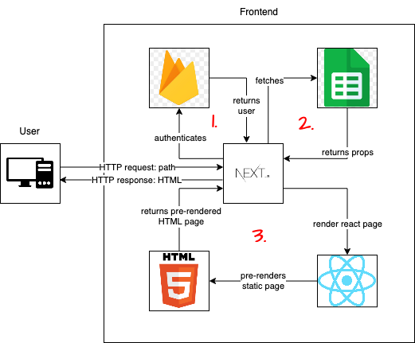
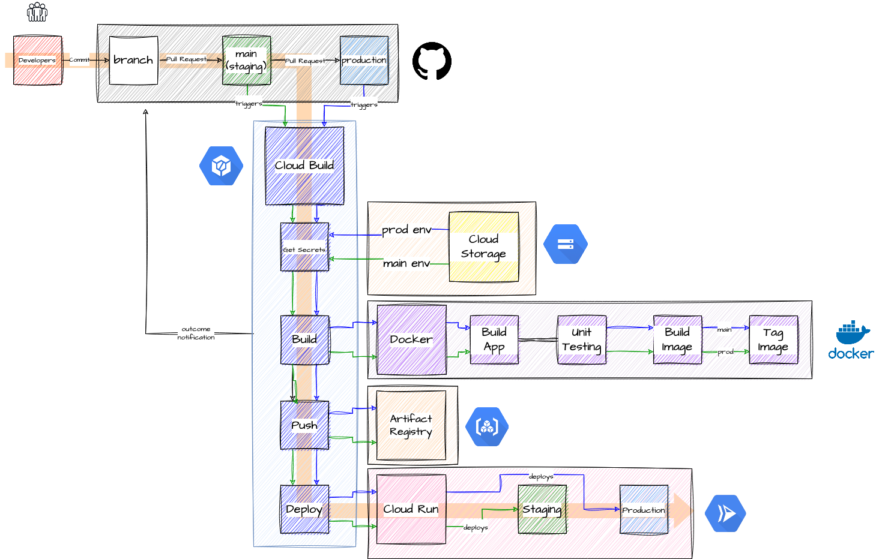

# Dashboard App

This is an application built with Next.js and React that serves static SSR web pages. The primary goal of this application is to allow a hypothetical company's administrative staff to oversee the company's operative results. This project is forked from a 2-day challenge for a frontend student job position. It was adapted as an academic project for learning purposes.

## Features

The application displays the following features:

    Total value of the company's sales for a given month
    Top 5 most sold products
    Top 5 recent orders
    Company's revenue target for the month
    Automatic data refresh every minute (if there are new data available)

## Technologies Used

The application uses the following technologies and frameworks:

    - Next.js
    - React
    - Firebase for: 
        - Authentication
        - Realtime Database (for user roles)
    - Google Sheets API for storing and fetching orders
    - Docker for containerization
    - Cloud Build / Cloud Run for continuous deployment
    - Cloud Storage for storing environment variables and service account keys
    - Artifacts Registry for storing Docker images
    - JEST and @testing-library/react for automated testing

> ⚠️ Note that the application is not using a database, but a spreadsheet. This is part of the requirements of the challenge. I would never use a spreadsheet as a database in a real-world public application.

## Pre-Rendering

The pre-rendering process is handled by [getServerSideProps](https://nextjs.org/docs/basic-features/data-fetching/get-server-side-props). An authenticated (*step 1*) request fetches the orders and revenue targets data (*step 2*) and passes them as props to the React page. The page is then server-side rendered and served as a static page to the client (*step 3*).

### Data Flow Diagram

## Continuous Deployment and Operation

The application is deployed using Google Cloud Build and Cloud Run. Continuous deployment is triggered by merging a new commit to the staging or production branches on GitHub. Before deployment, the code is tested using automated tests.

The .env file and the service account key are stored in cloud storage buckets, per environment (staging or production), and they are fetched during the cloud build steps.

### Cloud Infrastructure Diagram

## Local Deployment

To deploy the application locally, you would need to set up a Firebase project with authentication and a realtime database. You would also need a spreadsheet with orders and targets to work as the "database". Finally, you would need a service account key JSON file with the key to read and edit the spreadsheet.

Once you have set up these requirements, run `npm install` to install the necessary packages and `npm run build` to build the application. The application will run on `localhost:3000`.

## Security Considerations

Please note that this application is an academic project just for learning purposes. There are many security flaws, and it would require more time to make this app ready for production (if ever). I recommend using this application for educational purposes only.
